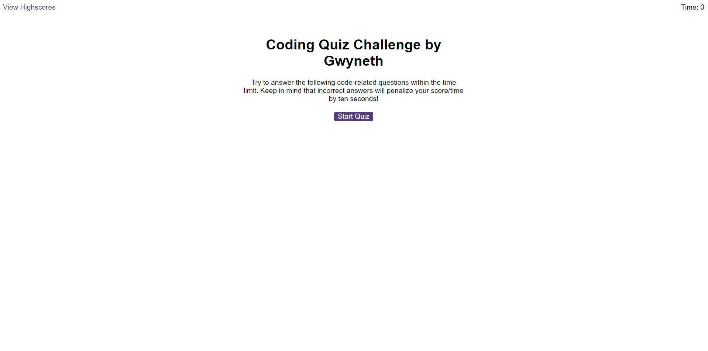
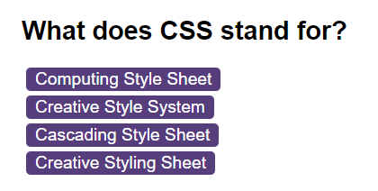
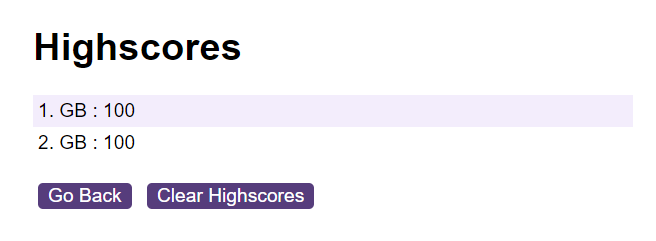

# Coding Quiz Challenge
This is a simple coding quiz challenge filled with topics about web development which is implemented using HTML, CSS, and JavaScript. This allows users to take a timed quiz and save their scores to a local leaderboard.

## Features
- Multiple-choice questions with timer.
- Feedback for correct and incorrect answers, with sound effects.
- Local leaderboard to store and display high scores.

## Getting Started
To run the game, simply click on the deployed link to start: 
-> https://lunar-potato.github.io/coding-quiz/

Or simply, clone the repository to your local machine and open and run index.html to start the quiz.

## How to Play
- Click the "Start Quiz" button to begin.
- Answer each question within the time limit.
- For every incorrect answer, 10 seconds are deducted from your remainting time.
- Scores are based to your remaining time.
- At the end of the quiz, you can save your score by entering your initials and clicking "Submit".
- View the leaderboard by clicking "High Scores" link.

## Screenshots

 ## About
 This game was created with HTML for the website structure and CSS for the design and JavaScript for the logic of the game.

 ## Usage
 Users can use this as an actual game to learn terms in web development and this can also be used to see how web quiz games are made to see the logic behind it. 

 ## License
 License is under MIT. Please refer to the LICENSE in the repository. Thank you.